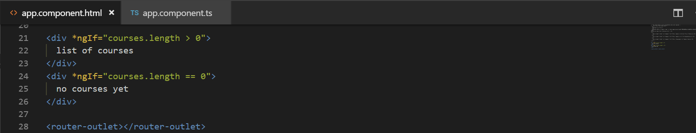
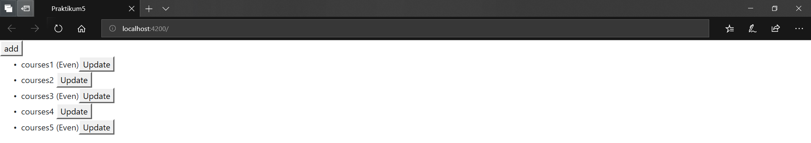
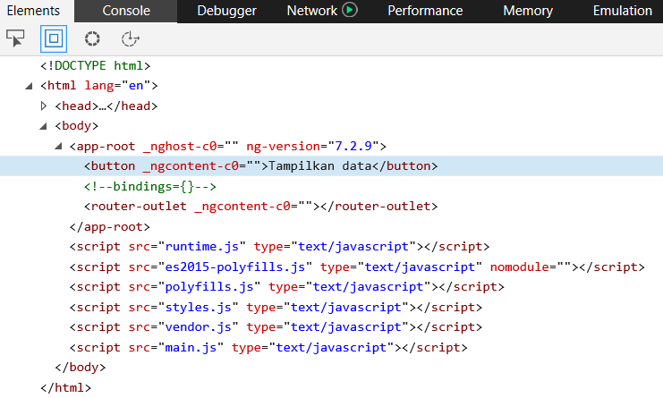

# 05. Directive

### Praktikum – Bagian 1: ngIf

##### Cara Pertama

* Buka file **courses.component.ts** kemudian tambahkan code seperti berikut:

* Buka file **courses.component.html** lalu tambahkan code seperti berikut:

* Jalankan localhost maka hasilnya seperti berikut:

* Jika array pada file **app.component.ts** (courses=[];) dikosongkan maka hasilnya:

##### Cara Kedua
* buka file **app.component.html** modifikasi kodenya menjadi berikut:

* jalankan localhost dengan kondisi array pada file **app.component** dengan array kosong

* Jalankan localhost maka hasilnya seperti berikut:

* Array yang ada isinya 

* Hasilnya seperti berikut:

##### Cara Ketiga
* buka file **app.component.html** modifikasi kodenya menjadi berikut:

* jalankan localhost dengan kondisi array pada file **app.component** dengan array kosong

* Jalankan localhost maka hasilnya seperti berikut:

* Array yang ada isinya 

* Hasilnya seperti berikut:

### Praktikum – Bagian 2: Hidden Property

* buka file **app.component.html** modifikasi kodenya menjadi berikut:

* Jalankan localhost maka hasilnya seperti berikut:

*  Selain contoh diatas kita juga dapat memberikan property seperti berikut:

* Dengan catatan pada app.component.ts pada courses terdapat array courses dengan nilai 1 dan 2

* Jalankan localhost maka hasilnya seperti berikut:

* Jika kita inspect element maka akan terlihat property hidden tidak terdapat kondisi true ataupun false

* Berbeda jika kita menggunakan ngIF terdapat bindings dengan nilai false

### Praktikum - Bagian 3: ngSwitchCase
Menyediakan ekspresi switch untuk menyamakan dengan ekspresi ngSwitch yang tersedia. Ketika ekspresi sama, maka template NgSwitchCase menampilkan.

* Buka file **app.component.html** modifikasi codenya menjadi seperti berikut:

* Buka file **app.component.ts** tambahkan property viewMode (line 12)

*  Hasilnya seperti berikut saat diklik list view maka akan muncul list view content dan jika kita pilih ListView maka akan tampil tulisan List View Content

### Bagian 4: ngFor
ngFor adalah sebuah directive pada angular yang berfungsi untuk melakukan looping terhadap beberapa data misal data kita adalah sebuah array, jadi directive ini akan melopping array kita pada bagian template.

* Buka **app.component.ts** property CoursesFor yang berisikan array (line 12)

* buka file **app.component.html** tambahkan directive ngFor

 

* Jalankan localhost maka hasilnya seperti berikut:

* kita juga dapat memberi tanda tertentu pada index yang bernilai ganjil dengan menggunakan isEven ``https://angular.io/api/common/NgForOf``

### Bagian 5: ngFor dan change Detection
Dengan memodifikasi directive ngFor kita dapat melakukan penambahan atau pengurangan data.

* Pada percobaan ini kita akan menambahkan sebuah data array pada coursesFor, tambahkan button pada **app.component.html**

* tambahkan method onAdd(), pada file **app.component.ts**

* Jalankan localhost maka hasilnya seperti berikut:

jika kita tekan button add maka akan ditambahkan sebuah data courses 6

* Tambahkan sebuah method onRemove pada **app.component.ts** untuk melakukan penghapusan data

* Buka **app.component.html** dan tambahkan sebuah button untuk menghapus

* Jalankan localhost maka hasilnya seperti berikut:

jika kita tekan button remove maka salah satu data akan hilang sementara

* buka file **app.component.html** tambahkan button

* buka file **app.component.ts** buatlah sebuah method ``onChange`` dengan parameter item dan didalam method tersebut adanya perubahan string menjadi ``updated``

* Jalankan localhost maka hasilnya seperti berikut:

jika kita tekan button update maka salah satu data akan berubah menjadi update

### Praktikum – Bagian 6: ngFor dan Trackby

* Buka file **app.component.ts** buatlah sebuah method dengan nama ``loadCourses``, tapi sebelumnya buat sebuah property dengan nama ``coursesForOne``

* Buka file **app.component.html** dan tambahkan code seperti pada gambar

* Hasilnya saat button belum diclick

* Hasilnya saat button sudah diclick

 

* Saat button belum diclick seperti pada gambar berikut

 

* Dan saat button diklik maka element ul akan muncul seperti pada gambar berikut

 

* Untuk menambahkan TrackBy dengan cara menambahkan pada file **app.component.html** pada directive ngFor

* Tambahkan juga sebuah method ``trackCourse`` dengan parameter index dan itemone pada file **app.component.ts**

### Praktikum – Bagian 7: The leading Asterik
Leading Asterik adalah tanda asterisk yang ada pada directive seperti *ngFor dsb. Adapun maksud leading asterisk pada sebuah directive adalah bahwa kita memberi tahu angular untuk menulis ulang markup tertentu

### Bagian 8: ngClass
jika pada percobaan sebelumnya kita membuat component favorite menggunakan 2 class binding yaitu class binding fa-star dan fa-star-o

### Bagian 9: Custom Directive

* Membuat directive dengan nama input-format terlebih dahulu dengan perintah seperti berikut

* Jika directive berhasil digenerate maka kita pastikan di **app.module.ts pada** ``@NgModule`` terdapat nama directive yang kita buat tadi

* Buka **input-format.directive.ts** dan tambahkan decorator HostListener seperti pada gambar berikut

* Buka file **app.component.html** dan tambahakn code berikut

* Pada saat kita click pada textbox maka pada console akan muncul onFocus tetapi jika click diluar textbox maka console akan keluat onBlur

* Buka file **input-format.directive.ts** dan modifikasi codenya menjadi berikut

* Jalankan localhost dan berikan masukan dengan huruf besar semua setelah itu tekan tab, jika berhasil maka valuenya akan berubah menjadi huruf kecil semua

* Buka file **app.component.html** dan tambahkan property binding dengan nama format

* Buka file **input-format.directive.ts** tambahkan decorator input dan modifikasi codenya seperti pada gambar berikut

* Format disini adalah kondisi di **app.component.html**

* Buka **input-format.directive.ts** dan tambahkan decorator input dengan parameter appInputFormat

