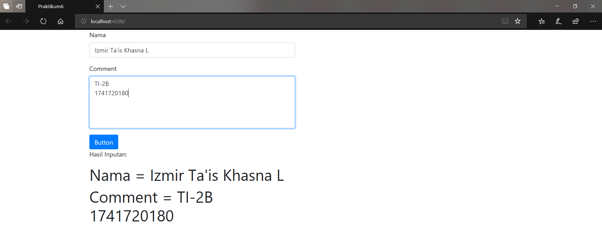
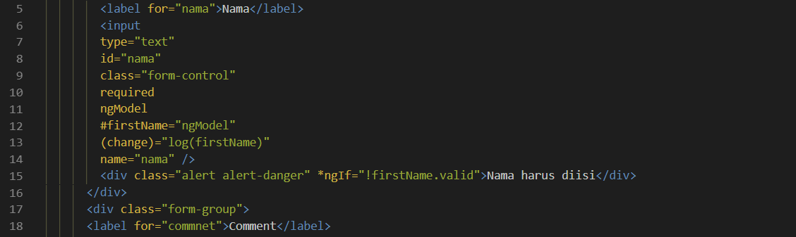
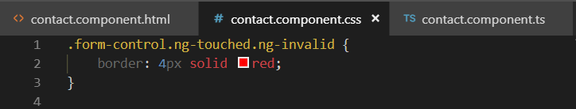
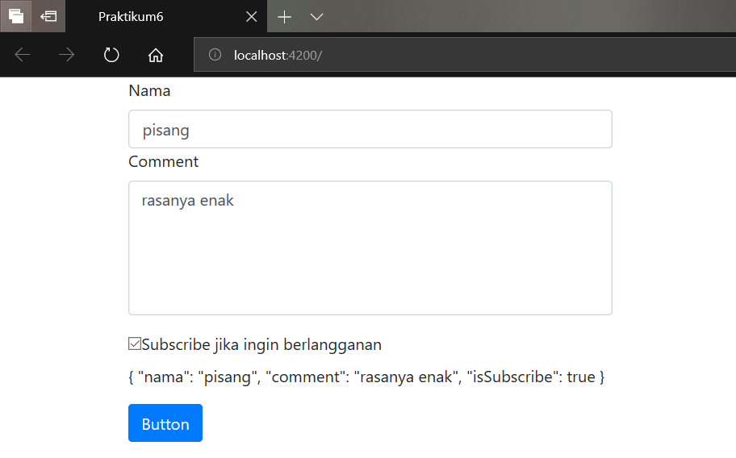
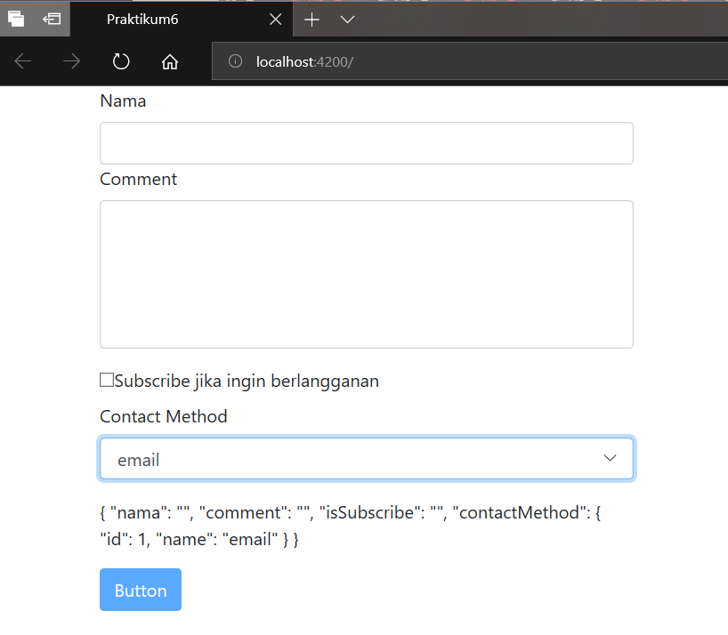

# 05. Template Driven Forms

### Praktikum – Bagian 1: Membuat Form Bootstrap

* Buatlah sebuah component dengan nama contact dengan kode ``ng g c contact`` 


* Buka file **contact.component.html** dan tambahkan code berikut :


* Buka file **app.component.html** dan tambahkan code berikut :


* Jalankan servernya maka hasilnya seperti berikut


### Praktikum – Bagian 2: Macam-Macam Form

* Generate 2 buah component dengan nama ``reactive-form`` dan ``template-driven``


* Buka file reactive-form.component.html dan buatlah code seperti berikut


* Buka file app.component.html dan tambahkan code berikut


* Jalankan servernya maka hasilnya seperti berikut


* Buatlah sebuah interface dengan nama ``mahasiswa.interface.ts`` di dalam folder app dan tambahkan code berikut


* Dikarenakan untuk menggunakan reactive-forms diperlukan **FormBuilder** dan **FormGroup** dari module ``ReactiveFormsModule`` maka kita harus tambahkan ReactiveFormModule dan FormGroup pada file ``app.module.ts`` seperti pada gambar berikut


* buka file **reactive-form.component.ts**, import terlebih dahulu **FormBuilder** dan **FormsGroup** dan tambahkan beberapa code berikut


* Buka file **reactive-form.component.html** dan modifikasi codenya menjadi seperti berikut


* Jalankan servernya maka hasilnya seperti berikut


* Untuk template-driven kita membutuhkan **FormsModule** pada app.module.ts, jadi buka file **app.module.ts** dan tambahkan FormsModule


* Buka file **template-driven.componentn.ts** dan tambahkan struktur form seperti berikut


* buka file **template-driven.component.html** dan tambahkan code berikut


* Tambahkan method onSubmit pada **template-driven.component.ts**


* Buka file **app.component.html** tambahkan code berikut


* Jalankan servernya maka hasilnya seperti berikut


### Praktikum – Bagian 3: ngModel
ngModel adalah sebuah directive untuk binding data atau value ke variable

* Buka file **contact-form.component.html** dan tambahkan ngmodel seperti berikut


* Buka file **contact-form.component.ts** dan tambahkan decorator input


* Jalankan servernya dan terdapat pesan error seperti pada gambar berikut


Keterangan : hal ini disebabkan jika kita menggunakan ngModel maka kita harus menambahkan atribut name pada tag tersebut

* Tambahkan atribut name pada tag input pada file **contact.component.html**


* Jalankan servernya maka hasilnya seperti berikut
(Catatan : tidak perlu diklik button untuk menampilkan data karena
tidak menggunakan event binding jadi inputan akan langsung tampil saat user memasukan data)



Selain itu juga dapat melihat properties pada ngModel

* Buka file contact.component.html modifikasi code berikut ini


* Pada textarea tambahkan juga ngModel seperti gambar berikut


* Buka file contact.component.ts modifikasi code berikut ini


* Jalankan server dan lihat pada inspect maka akan muncul property dari ngModel


### Praktikum – Bagian 4: Validasi
Membuat sebuah validasi dengan menggunakan bantuan directive

* Buka file **contact.component.html** dan tambahkan code ``required`` seperti gambar berikut



* Jalankan localhost dan lihat hasilnya


* Jika kita jalankan maka secara default alert akan muncul. Untuk itu kita membutuhkan sebuah kondisi lagi. Buka file **contact.component.html** tambahkan code berikut


* Jalankan localhost pada saat dijalankan maka secara default alert tidak akan muncul dan pada saat field nama dikosongkan maka akan muncul alert “Nama harus diisi”


### Praktikum – Bagian 5: Spesific Validasi Error
Ada beberapa macam untuk validasi error seperti minlength, maxlength, pattern dan required.

* Buka file conctact.component.html dan tambahkan beberapa code berikut


* Jalankan localhost jika kita masukkan angka 1


### Praktikum – Bagian 6: Styling Invalid Input Field
Kita dapat menambahkan sebuah style pada input fieldnya sebagai contoh jika terdapat error maka akan menampilkan.

* Buka file **contact.component.css** dan tambahkan code berikut



* Jalankan localhost jika kita inputkan salah


### Praktikum – Bagian 7: ngForm
ngForm adalah directive Angular yang penting untuk membuat template-driven forms.

* Buka file **contact.component.ts** dan tambahkan sebuah method submit seperti pada gambar berikut


* Buka file **contact.component.html** dan buatlah sebuah template variabel ngForm atau property ngForm dengan nama form (#form) yang nanti digunakan sebagai parameter dari method submit seperti pada gambar berikut 


* Pada button rubah codenya menjadi seperti berikut 


* Jalankan localhost dan inspect element,  masukkan pada field nama adalah pisang 


### Praktikum – Bagian 8: ngModelGroup

* buka file **contact.component.html** dan tambahkan code  seperti berikut 

```html
<div ngModelGroup="contact" #contact="ngModelGroup"></div>
          <div *ngIf="contact.value">contoh validasi pada ngModelGroup</div>
```

### Praktikum – Bagian 9: Disabling the Submit Button
Kita dapat membuat atau mengkondisikan button submit seperti button submit tidak akan dapat diklik jika nilai validnya sama dengan false

* Buka file **contact.component.html** dan tambahkan code berikut pada tag button


* Jalankan localhost jika berhasil secara default button akan disable, button akan enable saat terdapat inputan


### Praktikum – Bagian 10: Bekerja dengan Check Box

* Buka file contact.component.html dan tambahkan code check box seperti pada gambar berikut


* Jalankan localhost



### Praktikum – Bagian 11: Bekerja dengan Drop-down List
Selain menggunakan check box kita juga dapat menggunakan dropdown list

* Buka file **contact.component.html** tambahkan code untuk ``dropdown list`` seperti pada gambar berikut 


* Buka file **contact.component.ts** dan tambahkan code berikut 


* Jalankan localhost maka hasilnya seperti berikut


* Selain itu kita juga dapat menampilkan property id dan property nama dengan menggunakan property ngValue seperti berikut


* Sehingga hasilnya seperti berikut



* Selain itu juga kita dapat menggunakan multiple jika ingin memilih keduanya seperti pada gambar berikut


* Sehingga hasilnya seperti berikut (tekan control untuk dapat memilih keduanya)


### Praktikum – Bagian 12: Bekerja dengan Radio Button
Selain menggunakan check box dan dropdown list kita juga dapat menggunakan radio button

* buka file contact.component.html dan tambahkan code berikut


* Jalankan localhost (menggunakan ngModel)


* Jalankan localhost (tidak menggunakan ngModel)


* Bisa juga menggunakan directive ngFor untuk menampilkan value seperti berikut


* Sehingga hasilnya juga sama

