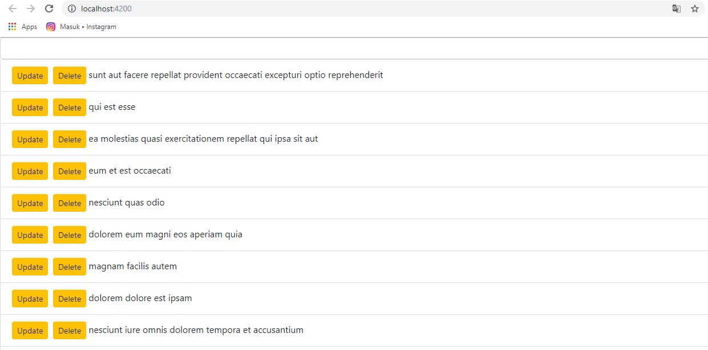

# 09. HTTP Service

### Praktikum – Bagian 1: JSONPlaceHolder

### Praktikum - Bagian 2 : Getting Data

* Buat component baru dengan nama signup-form dengan perintah ``ng g c posts``

* Untuk menggunakan ``HTTPService``, kita perlu melakukan ``import HttpModule`` pada file **app.module.ts**.

Setelah kita menambahkan HttpModule pada bagian imports maka secara otomatis akan menambah imports pada bagian paling atas 

Hint :
Jika HttpModule tidak muncul secara otomatis maka anda harus menginstal terlebih dahulu dengan perintah ``npm i @angular/http``
 
Setelah ``@angular/http`` terinstall, maka anda dapat menjalankan praktikum pada langkah 2.

* Modifikasi file **posts.component.ts** menjadi seperti berikut:
Class Http pada contructor digunakan untuk melakukan HTTP request ke back end.

* Ubah file **app.component.html** seperti berikut :

* Jalankan dan Catat hasilnya **(soal 1)**

* Bagaimana jika anda lupa melakukan import HttpModule pada langkah ke-2 ? Lakukan commenting pada HttpModule seperti pada kode berikut :

* Apa yang terjadi pada console? Berikan penjelasan atas error yang terjadiApa yang terjadi pada console? Berikan penjelasan atas error yang terjadi

* Lengkapi kode program pada file **posts.component.ts** menjadi :

* Jalankan pada browser dan jelaskan yang muncul pada console. **(soal 3)**

* Jelaskan perbedaan yang terjadi pada console jika kode pada file **posts.component.ts** diubah menjadi : **(soal 4)**

* Untuk menampilkan data pada halaman browser, ubah kode program pada **posts.component.html** seperti berikut :

* Ubah kode program pada **posts.component.ts** :

* Jalankan dan jelaskan apa yang muncul pada browser. **(soal 5)**

### Praktikum - Bagian 3 : Creating Data

* Kita akan menambahkan sebuah text area untuk memasukkan data melalui browser, seperti gambar berikut :

* Pertama, tambahkan input elemen pada file **posts.component.html** :

* Modifikasi kode program pada file **posts.component.ts**

* Simpan dan Jalankan. Jelaskan dengan kalimatmu sendiri bagaimana jalannya program setiap baris pada fungsi ``createPost``. **(soal 6)**

### Praktikum - Bagian 4 : Updating Data

* Kita akan menambahkan sebuah button ``Update`` untuk mengubah data melalui browser, seperti gambar berikut :

* Tambahkan button ``Update`` dengan modifikasi kode program seperti di bawah ini :

* Tambahkan fungsi **updatePost** pada posts.ts seperti di bawah :

* Simpan dan Jalankan. Apa fungsi patch pada potongan kode program pada langkah 3? **(soal 7)**

### Praktikum - Bagian 5 : Deleting Data

* Kita akan menambahkan sebuah button Delete di sebelah button Update untuk menghapus data melalui browser, seperti gambar berikut :
 

* Tambahkan button ``Delete`` dengan modifikasi kode program seperti di bawah ini :
 

* Tambahkan fungsi **deletePost** pada posts.ts seperti di bawah :

* Simpan dan Jalankan. Apa fungsi patch pada potongan kode program pada langkah 3? **(soal 8)**

